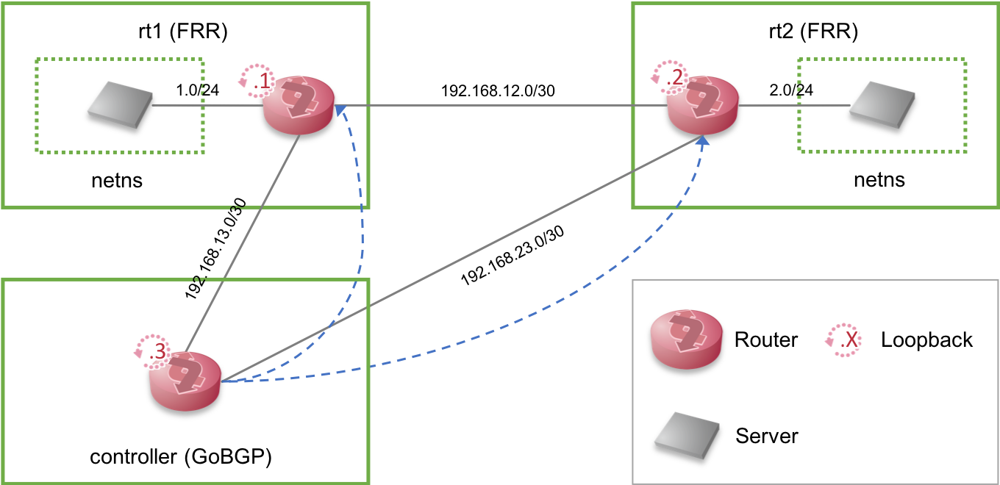

# BGP Flowspec

## Topology

## Description

* Each green square means virtual machines (VM). In each VMs, Ubuntu 18.04 is installed.
	* As of 30th, August, 2018, the kernel's version is 4.15.0-32-generic. It may be changed along with Ubuntu bionic's update.
	* The installed version of FRR is 5.0.1.
	* Gobgp's version is 1.29-1 (installed via apt)
* In rt1 and rt2, veth pair and netns are created. Netns works as if it were a server connected to router.
* Among routers, OSPF and BGP (iBGP) is used for exchanging routing information.
* controller (GoBGP) injects flowspec rules to FRR (rt1, rt2)

## Result

As of 30th, August, 2018, the flowspec rule is correctly inserted to FRR, but it is not validated. It may be the bug of FRR.